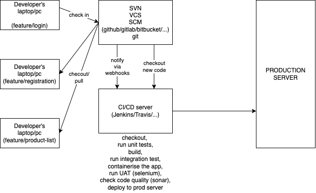

# Git fundamentals

## Some useful links:

-   [Git for Code Assignments](https://cs.wellesley.edu/~cs240/s19/docs/common/git/#concepts)
-   [Getting Started with Git](https://git-scm.com/book/en/v2/Getting-Started-About-Version-Control)

## Assignments:

-   [Link to assignments](./assigments.md)
