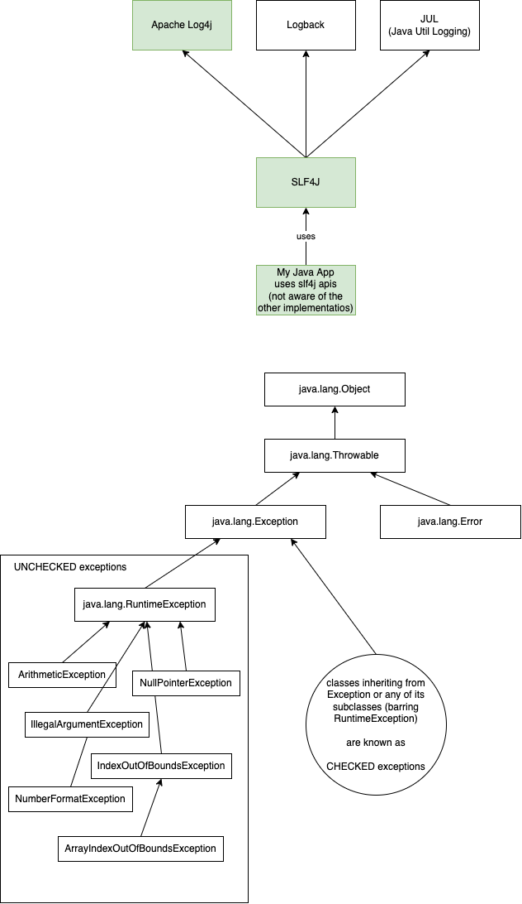

# Java Exceptions



---

### Assignment 1

Write a Java application to accept integers in a loop. After each number is accepted, the user should be asked if he/she wishes to continue. If the user inputs "NO", then the loop should be stopped and following output should be displayed:

```
Number of inputs = X
Number of integer inputs = Y
Number of non-integer inputs = Z
Sum of all integer inputs = XX
The integer inputs = N1, N2, N3, ...
The non-integer inputs = ASD, SDF, DFG, ...
X, Y, Z, etc should be actual values, based on the inputs.
```

HINT:

Use `java.util.Scanner` for accepting data from the user.

```java
Scanner s = new Scanner(System.in);
String input = s.nextLine();
int n = s.nextInt();
double d = s.nextDouble();
// ... s
```

---

### Assignment 2

Write a function called "calendar" that takes a String representing year/month in YYYY-MM format and returns a two-dimensional array representing the calendar for the input month and year.

For example, if the input is "2018-03”, then the output is:

```
{
	{0, 0, 0, 0, 1, 2, 3},
	{4, 5, 6, 7, 8, 9, 10},
	{11, 12, 13, 14, 15, 16, 17},
	{18, 19, 20, 21, 22, 23, 24},
	{25, 26, 27, 28, 29, 30, 31}
}
```

For input "2018-02", the output should be:

```
{
	{0, 0, 0, 0, 1, 2, 3},
	{4, 5, 6, 7, 8, 9 10},
	{11, 12, 13, 14, 15, 16, 17},
	{18, 19, 20, 21, 22, 23, 24},
	{25, 26, 27, 28, 0, 0, 0}
}
```

The method should throw a custom exception **InvalidDateException**, in case if the input does not represent a valid year/month combination, and **InvalidInputException** in case if the input is not in the expected YYYY-MM format.

---
