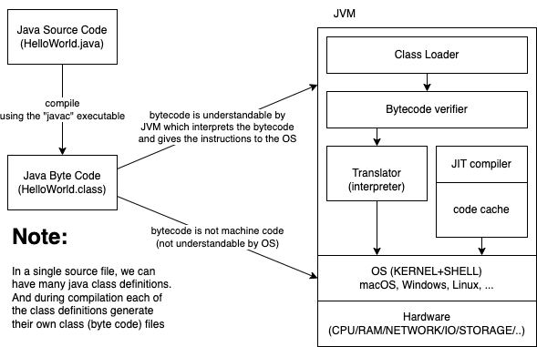

# Java - Day 1



## Variables

-   Can be of
    -   Primitive types
    -   Reference types

## Primitive (Java keywords/builtins) Datatypes in Java

-   Intetegers (-2^n to +(2^n)-1))
    -   byte (1 byte or 8 bits) (-128 to +127)
    -   short (2 bytes or 16 bits) (-32768 to +32767)
    -   int (4 bytes or 32 bits)
    -   long (8 bytes or 64 bits)
-   Real numbers
    -   float (4 bytes or 32 bits)
    -   double (8 bytes or 64 bits)
-   Text
    -   char (2 bytes or 16 bits to accommodate UNICODE values)
-   Logical
    -   boolean (1 bit - true/false)

## Wrapper classes

Provide useful methods (functions) related the datatype they represent

-   byte --> java.lang.Byte
-   short --> java.lang.Short
-   int --> java.lang.Integer
-   long --> java.lang.Long
-   float --> java.lang.Float
-   double --> java.lang.Double
-   char --> java.lang.Character
-   boolean --> java.lang.Boolean

## Functions

-   Named block of code, that can be invoked by calling them
-   May take pamaters (arguments)
-   May or may not return values (result of computation)

General syntax:

```java
[<modifier/s>] <return-type> <function-name>([<param1-type> <param1-name>, ...]) {
    // body of the method
    [return <return-value>]
}
```

## Programming consturcts

-   Selection (branching)
    -   if-else
    -   switch-case-default
-   Iteration (looping)
    -   while
    -   do-while
    -   for

### if-else

-   `condition` must be a boolean expression
-   Unlike C or C++, where 0 is considered as `false` and non-zero is considered as `true`

```java
    if(condition) {
        // statement
    }

    if(condition) {
        // statement-1
    }
    else {
        // statement-2
    }

    if(condition-1){
        // statement-1
    }
    else if(condition-2) {
        // statement-2
    }
    else if(condition-3) {
        // statement-3
    }
    else {
        // fallback statement
    }

    if(condition-1){
        //....
        if(condition-2){
            //....
            if(condition-3){
                // statement-1
            }
        }
    }

    if(condition1 && condition2 && condition3){
        // statement
    }


```

### `while` loop

```java
    while(condition){
        // statement
        // make sure to turn the condition to false some where in the loop
    }
```

### `for` loop

```java
    for(expr1; expr2; expr3){
        // statement
    }

    for(;;){
        // statement that is executed for ever
        // ; endless loop
    }
```

-   expr1 - optional; but usually a loop variable is initialized here; executed only once.
-   expr2 - optional; must be boolean; controls the execution of the loop body.
-   expr3 - optional; usually loop variable's value is altered

Working principle:

-   expr1 is evaluated first, and only once
-   expr2 is evaluated and if true, then the loop statement/body is executed
-   expr3 is evaluated and then expr2 is evaluated.

# Assignments

### Assignment 1

Write a function called "sumOfPrimes", that takes two integers as input and returns the sum of all the prime numbers between the same.

```java
public static int sumOfPrimes(int from, int to) {
	// do stuff here
	return 0;
}
```

Write a Java program to call the above function multiple times with different values.

---

### Assignment 2

Write a Java program to print the following pattern:

```
*
**
***
****
*****
```

The number of rows should be based on the value of a variable "num", and the number of stars in a row is based on the row number itself.

---

### Assignment 3

In trignometry, the Sine of an angle is represented by the series below:


Write a Java function that accepts angle in degrees and returns the sine of the given angle.

Call the function in main, multiple times by supplying multiple values and verify the same.

PS:

-   Divide the function into small reusable functions, if possible.
-   Do not use builtin Java classes like `Math`
-   Inside the **sine** function, use a loop that iterates for **n** times (for example 10)

---

### Assignment 4

Implement the Java function listed below:

```java
public static void printCalendar(int month, int year) {
	/// do stuff here
}
```

The function should accept `month` and `year` and print the calendar for the same. If inputs are invalid, appropriate error message/s should be printed.

Sample output for the inputs (8, 2018):

```
Su Mo Tu We Th Fr Sa
          1  2  3  4
 5  6  7  8  9 10 11
12 13 14 15 16 17 18
19 20 21 22 23 24 25
26 27 28 29 30 31
```

PS:

-   Do not use any builtin Java classes like `Date` or `Calendar`
-   Divide the function into small reusable functions, if possible.

---

### Assignment 5

Write a function called "sumOfEvensAndOdds", that takes an array of integers as input and returns another array of integers of length 2. The first element in the returned array is the sum of all even numbers in the input array, and the second element in the returned array is the sum of all odd numbers in the input array.

```java
public static int[] sumOfEvensAndOdds(int []nums) {
	// do stuff here
	return null;
}
```

For example,

```java
int [] nums = {1, 2, 3, 4, 5, 6, 7, 8, 9, 10};
int [] result = sumOfEvensAndOdds(nums);
// result should be equal to {30, 25}
```

Hint:

An arrays is created as shown below:

```java
int []arr = new int[2];
arr[0] = 12;
arr[1] = 100;
```

or

```java
int []arr = {12, 100}
```

Call the function in main, multiple times by supplying multiple values and verify the same.

---

### Assignment 6

Write a function called "reverseByWords", that takes a sentence (string) as an input, and returns another string. The return value must be a sentence in which the words in the original sentence appear in reverse order.

```java
public static String reverseByWords(String sentence) {
	// do stuff here
	return null;
}
```

For example,

```java
String out = reverseByWords("my name is vinod and i live in bangalore");
// the variable "out" should be equal to "bangalore in live i and vinod is name my".
```

Call the function in main, multiple times by supplying multiple values and verify the same.

---

### Assignment 7

Write a function called "inWords" that takes a number between 1 and 99,99,99,999 and returns a String representing the input number in words.

```java
public static String inWords(int num) {
	// do stuff here
	return null;
}

```

For example,

```java
inWords(12345);
// should return "twelve thousand three hundred forty five"
inWords(10203040);
// should return "one crore two lakh three thousand forty"
inWords(101);
// should return "one hundred one"
```

Call the function in main, multiple times by supplying multiple values and verify the same.
